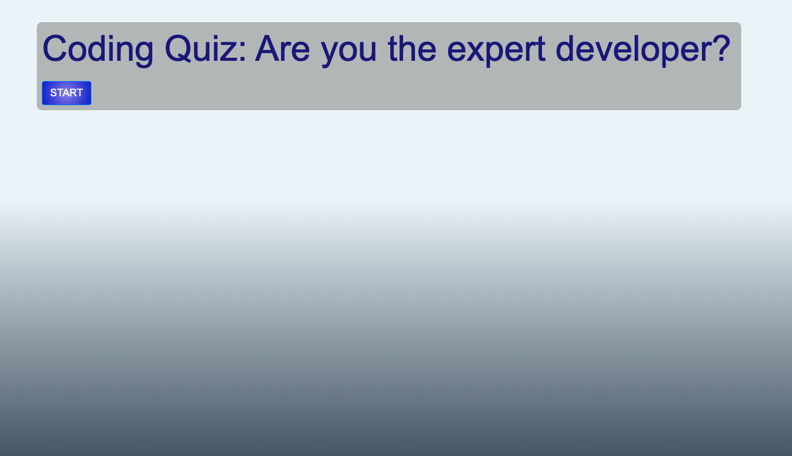

# <Coding quiz>

## Description

- My task was to create an online quiz using JavaScript which would interactively bring up questions with multiple choices and then provide feedback and a high scores page after the end
- I was motivated by the idea of using JavaScript in a new and exciting way, rising to the challenge of multiple page changes and complete user-interactive control
- This has been a great test of my JavaScript capabilities and has felt incredibly rewarding, especially on seeing everything that I had wrote come together and working fluidly
- This site features many questions about topics that I have come across and learnt through my path to becoming a web developer and it makes me proud to see my learnings displayed successfully

## Instructions

To begin my quiz, simply press the 'Start' button and you will be faced with a series of questions that will come one after the other until all questions have been answered or until the timer runs out. You will be able to add your name at the end and enter the high-scores page. Be warned, your score will depend on how quickly you complete the quiz, and wrong answers will result in a time penalty! Try to get the highest score!!

## Demo

## Access

To access my Coding Quiz, I've added these links

GitHub Repository:
https://github.com/kieranmichaelflynn/Week4-homework.git

GitHub Pages: 
https://kieranmichaelflynn.github.io/Week4-homework/

Thank you